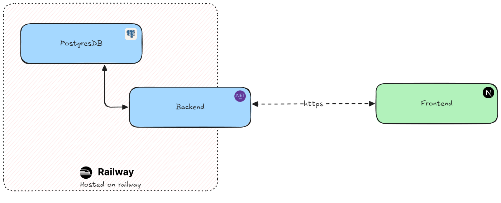

# Arkance GS - frontend

## Getting Started

1. Make sure you have [Node.js > 20.0.0](https://nodejs.org/en/) installed.

```bash
npm install
```

2. Copy the `.env.example` file to `.env` and set the environment variables. (should work outside of the box)

3. Then, run the development server:

```bash
npm run dev
```

> [!IMPORTANT]
> The backend should be running (see here for more info: [Arkance GS - back end](https://github.com/larryTientcheu/Arkance))
> Otherwise, you can use the hosted backend `https://arkance-production.up.railway.app/api` (edit the `.env` file to use it)

Open [http://localhost:3000](http://localhost:3000) with your browser to see the result.


## About this project

This project is an evaluation project for managing students and their notes.

- Written in TypeScript and uses [Next.js 14](https://nextjs.org/).
- [Tailwind CSS](https://tailwindcss.com/) for styling and [Shadcn/UI for components](https://ui.shadcn.com/).
- Deployed on [Vercel](https://vercel.com/).

## What's next?

- More tests to make it more robust
- Error handling with graceful fallback
- Better visuals
- Improved discoverability of features
- Improved a11y for better user experience


## Architecture

